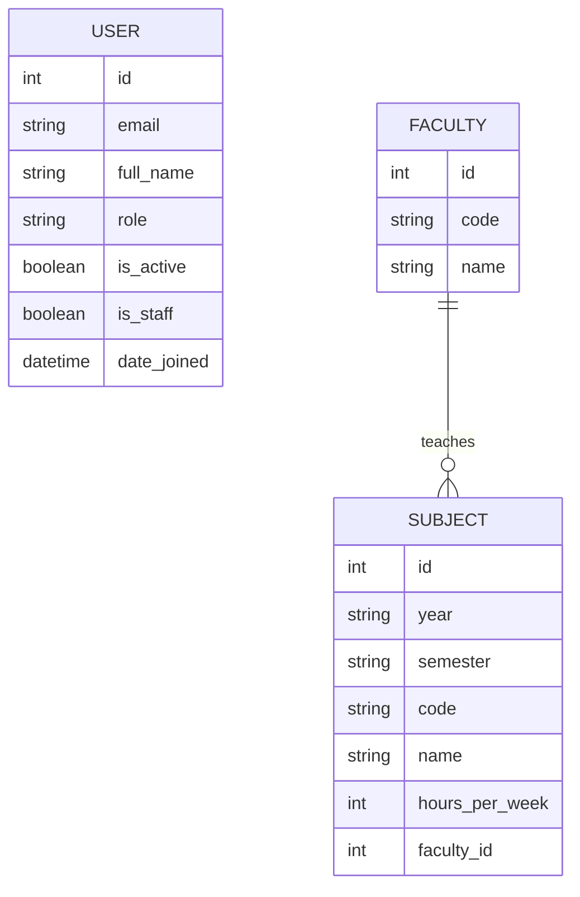
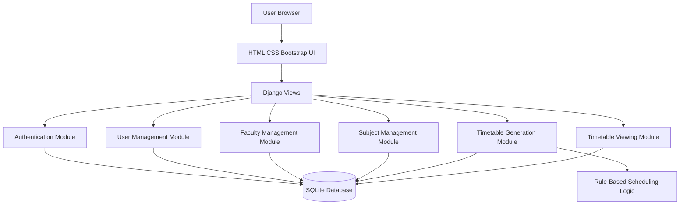

# Online Timetable Management System for Colleges

## Table of Contents

| S.No | Content | Page No. |
| --- | --- | --- |
| 1 | Abstract | 1 |
| 2 | Introduction | 2 |
| 3 | Problem Statement | 3 |
| 4 | Objectives | 4 |
| 5 | System Analysis | 5 |
| 6 | System Design | 6 |
| 7 | Implementation | 7 |
| 8 | Testing | 8 |
| 9 | Results | 9 |
| 10 | Conclusion | 10 |
| 11 | Future Scope | 11 |
| 12 | References | 12 |

## Project Details

The Online Timetable Management System for Colleges is a web-based application developed using Django. It helps colleges manage academic timetables, faculty assignments, subjects, and user roles from a centralized platform. The system supports assistant, faculty, and student users, each with role-based access. It provides secure email-based authentication, subject and faculty management, automated timetable generation, and workload tracking for faculty members.

## Abstract

Timetable preparation is one of the most important and time-consuming administrative activities in colleges. When handled manually, the process often produces scheduling conflicts, duplicate allocations, and difficulties in updating class information. This project presents an Online Timetable Management System for Colleges built with Django to reduce manual work and improve scheduling efficiency. The system allows assistants to manage users, faculty, subjects, and yearly schedules while giving faculty and students easy access to timetable data. It includes role-based authentication, automated timetable generation, subject-hour handling, laboratory session grouping, and workload analysis. By using a centralized database and simple web interface, the project improves consistency, reduces errors, and makes timetable administration easier.

## Explanation of Project Title

- `Online`: The system runs as a web application and can be accessed through a browser.
- `Timetable Management`: The project focuses on managing class schedules, faculty allocations, and academic time slots.
- `System`: It is a complete software solution with database, business logic, and user interface.
- `for Colleges`: The application is designed for academic institutions that need structured timetable planning.

## Introduction

In many colleges, timetables are still prepared using paper records, spreadsheets, or separate software tools. These methods are difficult to maintain because they require repeated manual updates whenever faculty, subjects, or class hours change. A small modification in one part of the schedule can affect multiple classes and create conflicts.

This project introduces a Django-based Online Timetable Management System that centralizes these tasks. Assistants can manage academic years, subjects, and faculty details, while faculty and students can view relevant timetable information through a single application. The project also improves reliability by using a database-backed system and role-based access control.

## Domains Used

- Web Development
- Database Management Systems
- Educational Technology
- Human Computer Interaction
- Role-Based Access Control

## Problem Statement

Traditional timetable preparation causes several institutional problems:

- It is time-consuming and repetitive.
- It is prone to human error.
- Updating schedules is difficult after initial creation.
- Faculty allocation and workload tracking are hard to maintain manually.
- Students and faculty do not always have centralized access to updated timetables.
- Laboratory sessions require consecutive periods, which are difficult to plan manually.

## Objectives

- To develop a centralized timetable management system for colleges.
- To reduce manual effort in timetable creation and updates.
- To support role-based access for assistant, faculty, and student users.
- To manage faculty and subjects efficiently through a web interface.
- To generate timetables using timetable rules and slot allocation logic.
- To provide easy timetable viewing and faculty workload information.
- To improve data consistency and reduce scheduling conflicts.

## Features

- Email-based login using a custom user model.
- User roles for assistant, faculty, and student.
- Registration and authentication with password validation.
- Faculty management with unique short codes.
- Subject management with academic year, semester, faculty, and weekly hour mapping.
- Timetable generation for different academic years.
- Laboratory identification and consecutive-slot scheduling.
- Faculty workload calculation.
- Role-based dashboard and navigation.
- Django admin access for advanced management.

## Modules

### 1. Authentication Module

- Custom user model with email as username.
- Login and registration forms.
- Logout and account switching support.
- Password hashing through Django authentication.

### 2. User Management Module

- Create assistant, faculty, and student accounts.
- Prevent duplicate user emails.
- Role-based permissions for access control.

### 3. Faculty Management Module

- Add, edit, and delete faculty records.
- Maintain faculty code and name.
- Track how many subjects are assigned to each faculty member.

### 4. Subject Management Module

- Add subjects based on year and semester.
- Assign subjects to faculty members.
- Configure weekly hours.
- Identify lab subjects automatically.

### 5. Timetable Generation Module

- Generate a timetable for a selected academic year.
- Allocate laboratory subjects in three consecutive periods.
- Spread theory subjects across the week.
- Avoid repeated placement of the same subject on the same day.

### 6. Timetable Viewing Module

- Show timetable by year and semester.
- Highlight faculty classes for faculty users.
- Provide a printable timetable layout.
- Display workload summary for each faculty member.

## Module-Wise Explanation

### 1. Authentication and Authorization Module

The Authentication and Authorization Module is responsible for secure user access to the system. It is implemented using Django's authentication framework along with a custom user model where email is used as the primary login credential. The module supports account registration, login, logout, and session handling. It also enforces role-based authorization by distinguishing assistant, faculty, and student users. This ensures that only authorized users can access specific system functions and protected pages.

### 2. User Management Module

The User Management Module enables the creation and administration of system users. Through this module, assistant users can add and manage accounts for students, faculty members, and other assistants. Each user account contains basic information such as full name, email address, password, and role. The module also validates user input, prevents duplicate email registration, and maintains proper role assignment for controlled system access.

### 3. Faculty Management Module

The Faculty Management Module is designed to maintain faculty-related information in a structured manner. It stores faculty codes and faculty names, which are later used during subject assignment and timetable generation. The module allows assistants to add, update, and remove faculty records while preserving referential integrity. It also supports monitoring of subject allocation counts for each faculty member.

### 4. Subject Management Module

The Subject Management Module handles academic subject data for different academic years and semesters. Each subject is associated with a subject code, subject name, faculty member, and required hours per week. This module is essential for organizing timetable data because it defines the academic structure from which schedules are generated. The system also identifies laboratory subjects automatically when the subject code or name contains the term "Lab."

### 5. Timetable Generation Module

The Timetable Generation Module is the core processing unit of the application. It applies a rule-based scheduling algorithm to generate timetable data for the selected academic year. Laboratory subjects are scheduled first in blocks of three consecutive time slots, while theory subjects are distributed across the week. The module also includes checks to avoid repeated subject allocation on the same day and to reduce consecutive repetition of theory classes. This module ensures that the generated timetable remains structured and practical for academic use.

### 6. Timetable Viewing and Reporting Module

The Timetable Viewing and Reporting Module presents the generated timetable in a readable tabular format. It allows faculty and students to view timetable data according to their role. Faculty users can identify their own classes through visual highlighting, while assistant users can review the complete timetable and faculty workload summary. The printable timetable layout and workload table improve usability and administrative reporting.

### 7. Dashboard Module

The Dashboard Module serves as the main entry point after user login. It displays role-specific information and provides navigation to the relevant system functions. For assistants, the dashboard includes management shortcuts, system statistics, and quick access to administrative operations. For faculty and students, it acts as an overview page leading to timetable viewing. This module improves navigation efficiency and overall user experience.

## Algorithm / Model Used

The system uses a rule-based scheduling approach.

### Rule-Based Scheduling Logic

- Subjects are grouped by semester.
- Laboratory subjects are identified first and scheduled in blocks of three consecutive periods.
- Theory subjects are then distributed across available slots.
- The same subject is not repeated consecutively in a day.
- The same subject is not assigned more than once per day for a semester.
- Faculty workload is calculated from the generated timetable entries.

### Supporting Logic

- Conflict avoidance through slot availability checks.
- Time slot allocation using shuffled day and slot traversal.
- Faculty workload aggregation using theory and lab counts.

## Advantages

- Reduces manual scheduling effort.
- Improves timetable consistency.
- Makes timetable updates easier.
- Supports multiple roles in one system.
- Provides centralized access to timetable information.
- Handles lab sessions more realistically.
- Displays faculty workload clearly.

## Disadvantages

- Current timetable generation uses rule-based logic rather than advanced optimization algorithms.
- Randomized slot selection may produce different valid schedules on different runs.
- Classroom and room allocation are not yet modeled.
- Notifications and reporting are limited in the current version.

## Why Should Select This Project

- It solves a real administrative problem faced by colleges.
- It is easy to explain during project review and viva.
- It demonstrates practical Django development.
- It includes both backend and frontend concepts.
- It uses authentication, database design, templates, and scheduling logic in one project.
- It can be extended with advanced features in future work.

## Existing System Statement

In the existing system, timetable creation is often done manually or with spreadsheets. These methods are slow, difficult to maintain, and prone to conflicts. They do not provide centralized role-based access and make it hard to manage changes efficiently.

## Proposed System Statement

The proposed system is a Django-based Online Timetable Management System that centralizes timetable creation, subject assignment, faculty management, and user access. It improves accuracy, reduces repetitive effort, and provides a structured, role-based platform for managing academic schedules.

## Software Requirements

- Operating System: Windows / Linux
- Programming Language: Python
- Framework: Django 4.2
- Frontend: HTML, CSS, JavaScript
- UI Library: Bootstrap 5
- Database: SQLite
- IDE: Visual Studio Code
- Browser: Google Chrome or any modern browser

## Hardware Requirements

- Processor: Intel Core i3 or above
- RAM: Minimum 4 GB
- Storage: 256 GB HDD/SSD or above
- System Type: 64-bit
- Input Devices: Keyboard and mouse
- Output Device: Monitor
- Internet Connection: Required for package installation and remote access scenarios

## Literature Review

Timetable management systems are a common application area in educational software. Earlier manual systems lacked flexibility and required significant staff effort. Modern web-based systems improved accessibility and centralized data handling. Research in timetable generation includes rule-based systems, greedy methods, constraint satisfaction approaches, and evolutionary algorithms.

For small and medium academic systems, rule-based scheduling remains practical because it is easier to understand, implement, and maintain. Role-based systems have also become important because administrators, faculty, and students require different data access and permissions. This project follows that practical pattern by combining database-backed management, role-based access, and timetable generation in a simple, maintainable architecture.

## System Analysis

### Functional Requirements

- User login, registration, and logout.
- User role handling for assistant, faculty, and student.
- Faculty creation, editing, and deletion.
- Subject creation, editing, and deletion.
- Academic year selection.
- Timetable generation by year.
- Faculty-specific highlighting in the timetable.
- Faculty workload reporting.

### Non-Functional Requirements

- Easy-to-use interface.
- Secure password handling.
- Data consistency using relational models.
- Responsive layout using Bootstrap.
- Maintainable code structure with separate apps.

### Feasibility Analysis

- Technical Feasibility: High, because the project uses widely available Django and SQLite technologies.
- Economic Feasibility: Good, because it is low cost and based on open-source tools.
- Operational Feasibility: Good, because the interface supports practical day-to-day use by academic staff and students.

## System Design

### Architecture

The system follows Django's MVT architecture:

- `Models`: Store users, faculty, and subject data.
- `Views`: Handle authentication, management operations, and timetable generation.
- `Templates`: Provide the web interface for dashboards and management screens.

### Main Components

- `accounts` app for authentication and custom user handling.
- `core` app for faculty, subjects, timetable generation, and dashboards.
- SQLite database for persistence.
- Bootstrap-based templates for UI rendering.

### Database Design

#### User

- `email`
- `full_name`
- `role`
- `is_active`
- `is_staff`
- `date_joined`

#### Faculty

- `code`
- `name`

#### Subject

- `year`
- `semester`
- `code`
- `name`
- `faculty`
- `hours_per_week`

## ER Diagram

### ER Diagram Explanation

The database design of the project is centered on three major entities: `User`, `Faculty`, and `Subject`. The `User` entity stores authentication and role-related details for all system users. The `Faculty` entity stores faculty records using a unique faculty code and faculty name. The `Subject` entity stores academic subject information such as year, semester, subject code, title, assigned faculty member, and weekly hours. A one-to-many relationship exists between `Faculty` and `Subject`, meaning one faculty member can teach multiple subjects, while each subject is assigned to one faculty member.

## System Architecture Diagram

### Architecture Diagram Explanation

The system follows a layered web application architecture based on Django's Model-View-Template pattern. The browser layer is responsible for user interaction through HTML, CSS, JavaScript, and Bootstrap-based templates. Requests from the browser are processed by Django views, which coordinate business logic and data operations. The application layer contains modules for authentication, user management, faculty management, subject management, timetable generation, and timetable viewing. These modules interact with the SQLite database for persistent data storage. The timetable generation module further relies on rule-based scheduling logic to create structured schedules. This architecture keeps presentation, logic, and data handling clearly separated.

### User Roles

- `Assistant`: Full management access.
- `Faculty`: View timetable with personal class highlighting.
- `Student`: View timetable in read-only mode.

## Implementation

The project is implemented using Django with separate apps for authentication and core timetable operations.

### Authentication Implementation

- A custom Django user model is used.
- Email is configured as the login identifier.
- Registration captures name, email, password, and role.
- Django authentication handles secure password storage.

### Faculty and Subject Management

- Faculty records are stored with unique short codes.
- Subjects are mapped to academic year, semester, faculty, and weekly hours.
- Management pages allow assistants to add, edit, and delete records.

### Timetable Generation

- The timetable is generated for a selected academic year.
- Days are Monday to Saturday.
- Time slots are divided into morning and afternoon sessions.
- Labs are scheduled first in consecutive blocks.
- Theory subjects are spread across remaining slots.
- Faculty workload is derived from scheduled entries.

### Interface

- Shared layout with sidebar navigation.
- Dashboard showing role-specific information.
- Timetable table with printable view.
- Forms for managing users, faculty, and subjects.

## Testing

### Testing Methods Used

- Functional testing of login, registration, and logout.
- Role-based access testing for assistant-only pages.
- Timetable generation validation.
- Form validation testing for user and subject inputs.
- Django system checks.
- Automated tests for account switching flow.

### Sample Test Cases

1. Login with valid assistant credentials.
2. Login with invalid password.
3. Create a faculty record and verify it appears in the list.
4. Create a subject and verify it is associated with the selected year.
5. Generate a timetable and check that lab subjects occupy three consecutive slots.
6. Verify that faculty users see their own classes highlighted.
7. Confirm that students cannot access assistant-only management pages.

## Results

The system successfully provides a centralized timetable management solution with role-based access. Assistants can manage users, subjects, and faculty data. Timetables can be generated and displayed by academic year. Faculty workload is shown clearly, and faculty members can identify their own classes visually. The project demonstrates that a database-backed web application can improve timetable administration significantly compared to manual methods.

## Conclusion

The Online Timetable Management System for Colleges addresses the major problems of manual timetable preparation by introducing a centralized Django-based web platform. It simplifies subject and faculty management, supports role-based user access, and generates structured timetables using rule-based scheduling. The project is practical, maintainable, and suitable for academic administration use. It also serves as a strong educational project because it combines backend development, database management, and interface design.

## Future Scope

- Add classroom and room allocation.
- Introduce advanced scheduling algorithms such as genetic algorithms or constraint-based solvers.
- Add downloadable PDF and Excel timetable export.
- Add notification support for schedule updates.
- Add attendance or academic integration features.
- Provide audit logs for timetable changes.
- Add analytics and reporting dashboards.

## References

1. Django Documentation. https://docs.djangoproject.com/
2. Bootstrap Documentation. https://getbootstrap.com/
3. Python Documentation. https://docs.python.org/3/
4. Educational scheduling concepts and role-based web application design references.
